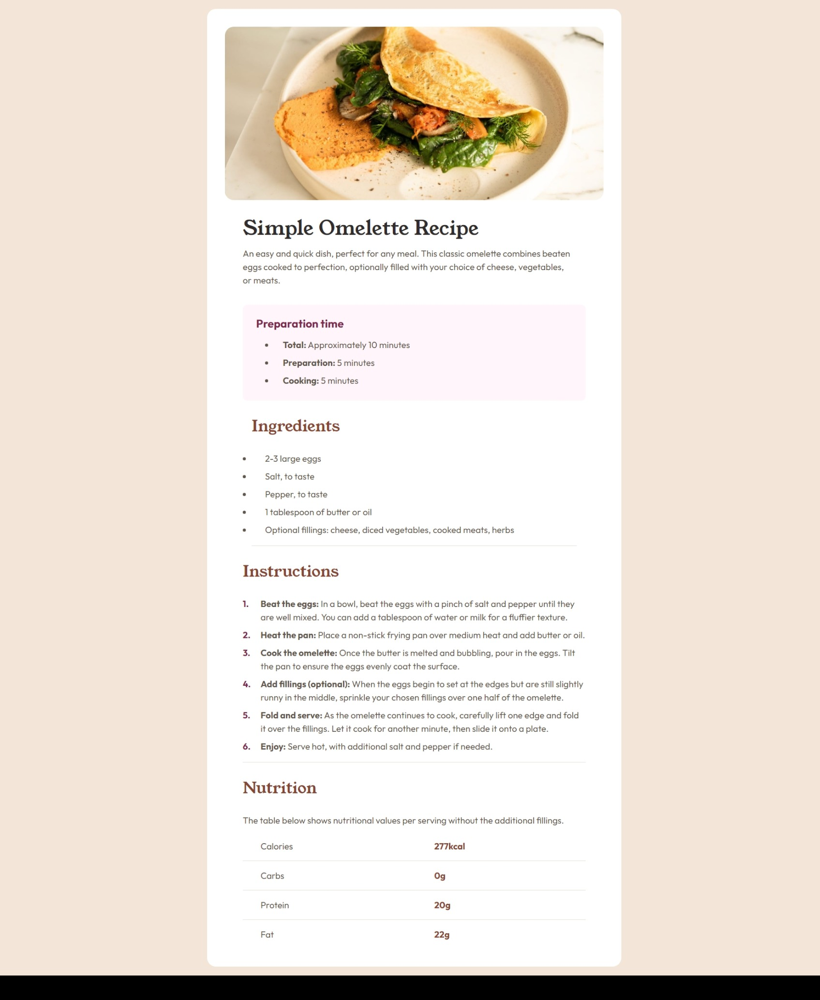

# Frontend Mentor - Recipe page solution

This is a solution to the [Recipe page challenge on Frontend Mentor](https://www.frontendmentor.io/challenges/recipe-page-KiTsR8QQKm). Frontend Mentor challenges help you improve your coding skills by building realistic projects.

## Table of contents

- [Overview](#overview)
  - [The challenge](#the-challenge)
  - [Screenshot](#screenshot)
  - [Links](#links)
- [My process](#my-process)
  - [Built with](#built-with)
  - [What I learned](#what-i-learned)
  - [Continued development](#continued-development)
- [Author](#author)

## Overview

### Screenshot

### Links

- Solution URL: [Github Code Solution](https://github.com/carlosmarte23/fem-recipe-page-main)
- Live Site URL: [Github Pages Solituon](https://carlosmarte23.github.io/fem-recipe-page-main/)

## My process

### Built with

- Semantic HTML5 markup
- CSS custom properties
- Flexbox
- Mobile-first workflow

### What I learned

This time i learned how to style tables and use two designs both on mobile and desktop. I started with the mobile design and then i did the desktop using media querys.

### Continued development

I struggled a lot with the styling of the table, but i finally got it, I need more practice so feedback is welcome.

## Author

- Website - [Carlos Marte's Github](https://github.com/carlosmarte23)
- Frontend Mentor - [@carlosmarte23](https://www.frontendmentor.io/profile/carlosmarte23)
- Twitter - [@carlosf04](https://www.twitter.com/carlosf04)
